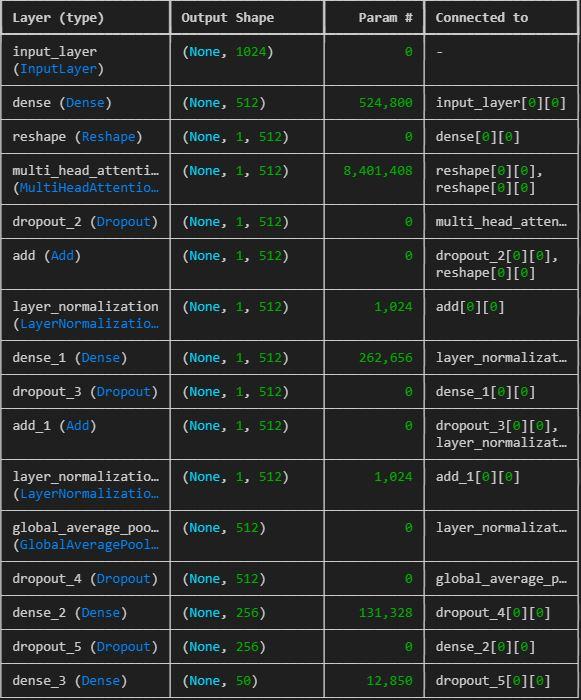
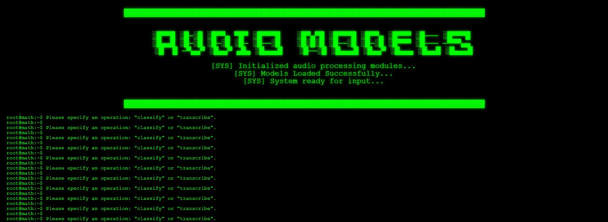

# AUDIO MODELS USE CASES

This repo contains the deployment of various use cases of Audio Models. Some of the model architectures are created and trained from scratch . While some other pretrained models are taken from [Huggingface](https://huggingface.co/models) and [Tensorflowh-Hub](https://tfhub.dev)

### Description of Use Cases: As of now this repository solves 2 use cases of Audo Models.

First be the Audo Classification. Second being the Audio Transcription. The architecture of the classification Model has been created from scratch on the **ESC-50** dataset on 50 classes. For the Audio Transcription , pretrained models have been used.

## Models Created From Scratch

The model has been been created from scratch using various iterations . It takes the input array of size (1024). its the specific size since all the audio files are first preprocessed using the SAMPLE_RATE=16000 . Then they embeddings are created using the Yamnet Model .

Pramaters: 

Total params: 9335090
Trainable params: 9335090 
Non-trainable params: 0 

Below is the architecture used. 

**[Acces Trained Model Shared on Huggingface](https://huggingface.co/datasciencesage/attentionaudioclassification)**

## Pretrained Models .

There are two pretrained models used in this project. One is for PREPROCESSING and the other to do the main task of AUDIO TRANSCRIPTION . The model used for preprocessing is **Yamnet Model** and the transcription one is **distil-large-v3**

## Datasets Used :

###  ESC: Dataset for Environmental Sound Classification 

The ESC-50 dataset is a labeled collection of 2000 environmental audio recordings suitable for benchmarking methods of environmental sound classification.

The dataset consists of 5-second-long recordings organized into 50 semantical classes (with 40 examples per class) loosely arranged into 5 categories:

| Animals | Natural soundscapes & water sounds  | Human, non-speech sounds | Interior/domestic sounds | Exterior/urban noises |
| :--- | :--- | :--- | :--- | :--- |
| Dog | Rain | Crying baby | Door knock | Helicopter |
| Rooster | Sea waves | Sneezing | Mouse click | Chainsaw |
| Pig | Crackling fire | Clapping | Keyboard typing | Siren |
| Cow | Crickets | Breathing | Door, wood creaks | Car horn |
| Frog | Chirping birds | Coughing | Can opening | Engine |
| Cat | Water drops | Footsteps | Washing machine | Train |
| Hen | Wind | Laughing | Vacuum cleaner | Church bells |
| Insects (flying) | Pouring water | Brushing teeth | Clock alarm | Airplane |
| Sheep | Toilet flush | Snoring | Clock tick | Fireworks |
| Crow | Thunderstorm | Drinking, sipping | Glass breaking | Hand saw |

The dataset can be downloaded as a single .zip file (~600 MB):

**[Download ESC-50 dataset](https://github.com/karoldvl/ESC-50/archive/master.zip)**

## Web Page

## External Links

**[ESC-50 Research Paper](https://www.karolpiczak.com/papers/Piczak2015-ESC-Dataset.pdf)**
**[PANNs: Research Paper](https://arxiv.org/pdf/1912.10211)**
**[PANNs: Research Paper](https://arxiv.org/pdf/1912.10211)**

